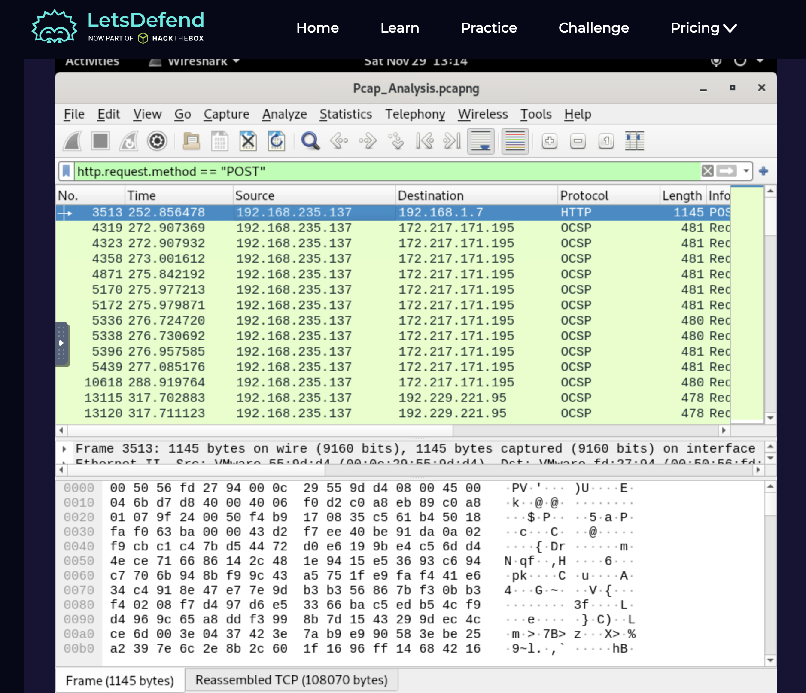
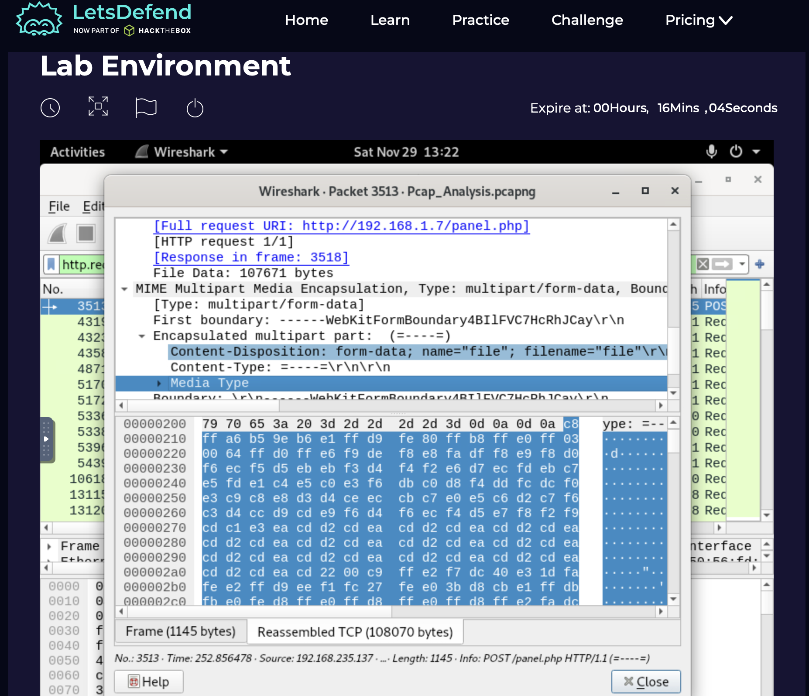
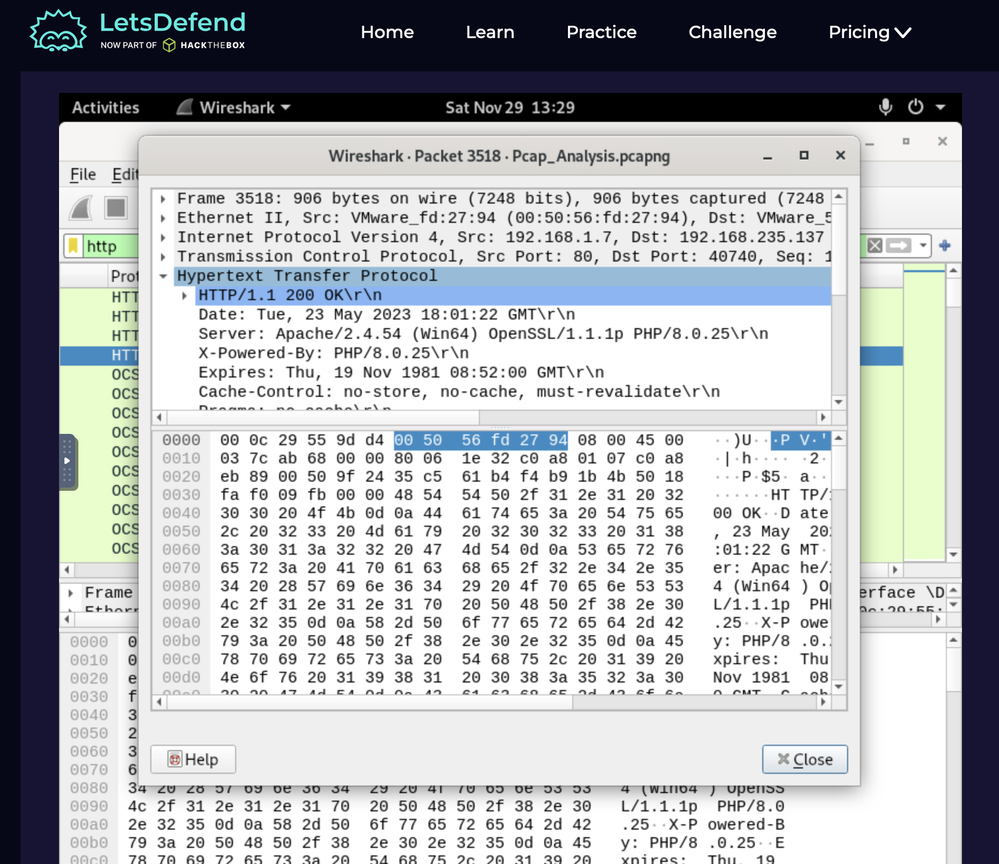

# PCAP Analysis Portfolio
A detailed PCAP analysis and network forensics investigation of a file transfer from host p13, demonstrating packet-level analysis, HTTP inspection, and investigative reasoning.

## PCAP Analysis Challenge – Network Forensics Investigation

This project showcases my ability to perform packet capture (PCAP) analysis, investigate network behavior, and extract meaningful forensic conclusions from raw traffic data. The challenge involved analyzing network packets from host p13 and identifying key details related to a file transfer over the network.

This repository includes:

* A detailed investigative report
* Screenshots of analysis steps
* Key insights and conclusions

## Objectives

The goal of this investigation was to identify:

* IP address of the sender and receiver in network communication
* IP address of the server
* Name of the file sent through the network
* Name of the web server that received the uploaded file
* Directory where the file was uploaded
* Total time taken to send the encrypted file

## Tools and Techniques

I used **Wireshark**, a network protocol analyzer, to:

* Filter network traffic using specific queries (e.g., TCP streams, HTTP POST requests)
* Reconstruct communication sessions between sender and receiver
* Examine HTTP headers and multipart data to extract file upload details
* Analyze packet timestamps to calculate transfer duration

These techniques allowed me to analyze raw network traffic and present clear, actionable findings.

---

## Investigation Steps

### 1. Identifying Sender and Receiver IP Addresses

To start, I filtered traffic associated with host p13 using TCP filters in Wireshark. This allowed me to isolate the packets sent and received by the host.

* **Source IP:** `192.168.235.137`
* **Destination IP:** `192.168.235.131`

> **Why it matters:** Identifying IP addresses is crucial to trace the flow of data and distinguish between the client (sender) and server (receiver) in the network.

### 2. Determining the Server IP Address

I focused on HTTP POST requests (`http.request.method == "POST"`) because file uploads typically use this method. By examining the packet details and destination IP, I determined the server address:

* **Server IP:** `192.168.1.7`

> **Why it matters:** Knowing the server IP helps map the network path and confirm where the file was sent.

### 3. Identifying the File Name

Within the POST packet, I expanded the MIME multipart encapsulation to locate the `Content-Disposition` header, which contained the uploaded file name:

* **Filename:** `file`

> **Why it matters:** This step links the network activity to the actual file being transferred, which is essential for forensic documentation.

### 4. Identifying the Web Server Name

To confirm the upload destination, I looked for a response packet with `HTTP/1.1 200 OK`. Inspecting the HTTP header revealed the server software:

* **Web Server:** `Apache`

> **Why it matters:** Knowing the server software can help understand server behavior and potential vulnerabilities.

### 5. Determining the Upload Directory

Analyzing the HTTP POST request headers and line-based text data showed the directory path:

* **Upload Directory:** `/uploads/`

> **Why it matters:** Tracking the directory confirms the file location on the server, completing the forensic picture of the transfer.

### 6. Calculating File Upload Duration

To determine how long the file transfer took, I analyzed the TCP stream corresponding to the upload using Wireshark’s **Statistics → TCP Stream** feature.

* **Filter the relevant traffic:** Used the source and destination IPs identified earlier to isolate packets involved in the file transfer. Ensured the byte size matched the uploaded file, confirming the correct stream.
* **Examine the stream duration:** Wireshark displays the total duration of the TCP stream and the bytes transferred, providing an accurate measure of the upload time.
* **Validate the stream:** Confirmed the stream by checking that both the payload size and the source/destination IPs matched the expected transfer.
* **Record the result:** The file upload took **`0.0073 seconds`**.

> **Why it matters:** Calculating transfer duration demonstrates network performance and session accuracy. It also confirms that the correct data was analyzed, linking the technical investigation back to measurable results.

---

## Summary of Findings

| Item | Result |
| :--- | :--- |
| **Sender IP** | `192.168.235.137` |
| **Receiver IP** | `192.168.235.131` |
| **Server IP** | `192.168.1.7` |
| **File Name** | `file` |
| **Web Server** | `Apache` |
| **Upload Directory** | `/uploads/` |
| **Upload Duration** | `0.0073 seconds` |

## Lessons Learned

Working through this PCAP analysis challenge was a rewarding experience that reminded me how powerful and fascinating network forensics can be. Starting from raw packets and piecing together the entire story — from identifying IP addresses to uncovering the file name, upload directory, and timing — felt like solving a real digital mystery.

This process deepened my appreciation for the details hidden in network traffic and strengthened my investigative mindset. It reinforced the importance of patience and careful observation when interpreting data that, at first glance, might seem like noise.

For me, this project was a great reminder to trust the process, follow the clues, and never underestimate the value of a methodical approach.

